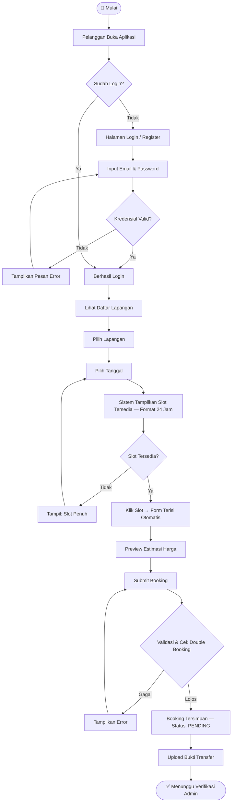
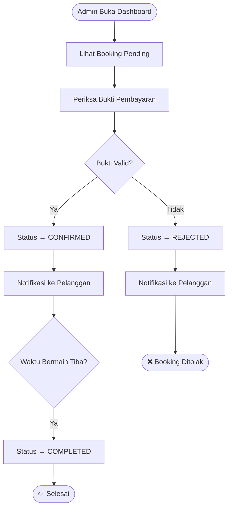
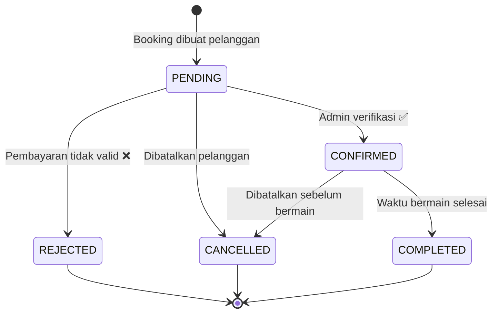
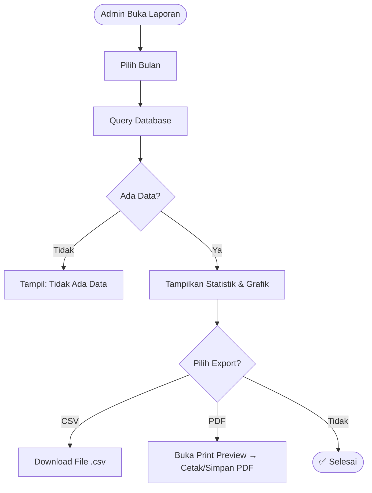

# MINI SKRIPSI

## RANCANG BANGUN SISTEM INFORMASI RESERVASI LAPANGAN OLAHRAGA BERBASIS WEB MENGGUNAKAN FRAMEWORK LARAVEL

> *Studi Kasus: Pengelolaan Jadwal dan Pembayaran pada SportBook*

---

| Item | Keterangan |
|---|---|
| Nama Aplikasi | SportBook |
| Program Studi | Teknik Informatika / Sistem Informasi |
| Jenjang | D3 / S1 |
| Tahun Akademik | 2025/2026 |
| Nama | [Nama Mahasiswa] |
| NIM | [NIM] |
| Pembimbing | [Nama Dosen Pembimbing] |

---

## ABSTRAK

Pengelolaan reservasi lapangan olahraga secara manual melalui pesan singkat dan catatan fisik menimbulkan berbagai permasalahan operasional seperti *double booking*, minimnya transparansi jadwal, dan sulitnya rekap keuangan. Penelitian ini bertujuan merancang dan membangun sistem informasi reservasi lapangan olahraga berbasis web bernama **SportBook** menggunakan framework Laravel 12 dengan pendekatan arsitektur *Model-View-Controller* (MVC).

Sistem yang dibangun mencakup modul pelanggan untuk melihat ketersediaan slot secara *real-time* dalam format 24 jam, melakukan pemesanan, dan mengunggah bukti pembayaran; serta modul admin untuk verifikasi pembayaran, manajemen lapangan, dan laporan pendapatan yang dapat diekspor ke format CSV dan PDF. Autentikasi menggunakan Laravel Sanctum untuk mendukung REST API yang dapat dikembangkan ke platform mobile di masa depan.

Pengujian *black-box* menunjukkan seluruh fitur utama berjalan sesuai spesifikasi. Sistem berhasil mencegah *double booking* melalui validasi berlapis di level aplikasi dan database, serta mampu menghasilkan laporan pendapatan per periode secara otomatis.

**Kata Kunci:** Sistem Informasi, Reservasi Lapangan Olahraga, Laravel, MVC, Real-Time, REST API

---

## DAFTAR ISI

1. [BAB I — PENDAHULUAN](#bab-i--pendahuluan)
2. [BAB II — LANDASAN TEORI](#bab-ii--landasan-teori)
3. [BAB III — METODOLOGI DAN PERANCANGAN SISTEM](#bab-iii--metodologi-dan-perancangan-sistem)
4. [BAB IV — IMPLEMENTASI DAN PENGUJIAN](#bab-iv--implementasi-dan-pengujian)
5. [BAB V — PENUTUP](#bab-v--penutup)
6. [DAFTAR PUSTAKA](#daftar-pustaka)

---

# BAB I — PENDAHULUAN

## 1.1 Latar Belakang

Olahraga merupakan kebutuhan mendasar masyarakat modern, baik untuk menjaga kesehatan fisik maupun sebagai sarana rekreasi dan sosialisasi. Seiring meningkatnya minat masyarakat terhadap olahraga seperti futsal, badminton, basket, dan mini soccer, kebutuhan akan fasilitas lapangan olahraga yang memadai pun terus berkembang. Hal ini mendorong munculnya berbagai usaha penyewaan lapangan olahraga di berbagai kota di Indonesia.

Namun demikian, sebagian besar pengelola lapangan olahraga masih mengandalkan sistem pemesanan manual. Proses reservasi dilakukan melalui aplikasi pesan singkat seperti WhatsApp, telepon, atau catatan buku harian. Metode konvensional ini mengandung sejumlah kelemahan yang berpotensi mengganggu operasional usaha, antara lain:

- **Double booking**, yaitu kondisi di mana dua atau lebih pelanggan memesan slot waktu yang sama akibat tidak adanya sistem pencatatan terpusat dan real-time.
- **Minimnya transparansi jadwal**, sehingga pelanggan tidak dapat mengecek ketersediaan lapangan secara mandiri dan harus selalu menghubungi admin terlebih dahulu.
- **Kesulitan rekap keuangan**, karena pencatatan transaksi masih bersifat manual sehingga rentan terhadap kesalahan dan kehilangan data.
- **Bukti transaksi tidak terdokumentasi**, yang dapat memicu perselisihan antara pelanggan dan pengelola.
- **Keterbatasan jam operasional layanan**, karena admin hanya bisa menerima pesanan saat aktif membalas pesan.

Kemajuan teknologi informasi, khususnya perkembangan pesat aplikasi berbasis web, membuka peluang untuk mengatasi permasalahan-permasalahan tersebut. Dengan sistem informasi reservasi berbasis web, pelanggan dapat melihat ketersediaan lapangan dan melakukan pemesanan kapan saja dan di mana saja, sementara pengelola dapat mengelola seluruh proses reservasi dan keuangan dalam satu platform yang terintegrasi.

Berdasarkan latar belakang tersebut, penelitian ini membangun sebuah sistem informasi reservasi lapangan olahraga berbasis web yang diberi nama **SportBook**. Sistem ini dikembangkan menggunakan framework **Laravel 12** dengan pola arsitektur MVC (*Model-View-Controller*), didukung antarmuka responsif menggunakan **Bootstrap 5**, serta dilengkapi REST API menggunakan **Laravel Sanctum** untuk skalabilitas ke platform mobile di masa depan.

## 1.2 Rumusan Masalah

Berdasarkan latar belakang yang telah diuraikan, rumusan masalah dalam penelitian ini adalah:

1. Bagaimana merancang dan membangun sistem informasi reservasi lapangan olahraga berbasis web yang dapat mencegah terjadinya *double booking*?
2. Bagaimana mengimplementasikan fitur pengecekan ketersediaan slot secara *real-time* dengan tampilan format waktu 24 jam yang mudah dipahami pengguna awam?
3. Bagaimana membangun alur manajemen pembayaran manual yang terstruktur dengan proses verifikasi oleh admin?
4. Bagaimana menghasilkan laporan pendapatan yang dapat diekspor dalam format CSV dan PDF untuk keperluan administrasi?

## 1.3 Tujuan Penelitian

Tujuan yang ingin dicapai dalam penelitian ini adalah:

1. Merancang dan membangun sistem informasi reservasi lapangan olahraga berbasis web menggunakan framework Laravel 12.
2. Mengimplementasikan mekanisme pencegahan *double booking* melalui validasi berlapis di level aplikasi dan database.
3. Menyediakan fitur slot ketersediaan real-time dengan format waktu 24 jam (00:00–23:00) yang dapat diakses pelanggan secara mandiri.
4. Menghadirkan dashboard admin dengan laporan pendapatan bulanan yang dapat diekspor ke format CSV dan PDF.
5. Menyediakan REST API berbasis token (Laravel Sanctum) sebagai fondasi pengembangan aplikasi mobile di masa depan.

## 1.4 Manfaat Penelitian

**Bagi Pengelola Lapangan:**
- Mengeliminasi risiko *double booking* melalui sistem pencegahan otomatis.
- Mempermudah rekap dan monitoring pendapatan harian maupun bulanan.
- Memiliki rekam jejak transaksi dan bukti pembayaran yang terdokumentasi secara digital.
- Meningkatkan efisiensi operasional dengan mengurangi beban komunikasi manual.

**Bagi Pelanggan:**
- Dapat mengecek ketersediaan lapangan dan melakukan pemesanan secara mandiri tanpa perlu menghubungi admin.
- Mendapatkan konfirmasi booking yang jelas, tercatat, dan dapat dilacak statusnya kapan saja.
- Pengalaman pemesanan yang lebih modern, cepat, dan transparan.

**Bagi Akademik:**
- Menjadi referensi implementasi sistem informasi *full-stack* berbasis Laravel dengan pola arsitektur MVC.
- Contoh nyata penerapan REST API menggunakan Laravel Sanctum.
- Dokumentasi teknis yang dapat dijadikan acuan untuk pengembangan sistem serupa.

## 1.5 Batasan Penelitian

Untuk menjaga fokus dan ruang lingkup penelitian yang terukur, ditetapkan batasan-batasan sebagai berikut:

- Sistem dibangun untuk satu venue (single-venue) pada versi ini; dukungan multi-venue dijadwalkan pada pengembangan lanjutan.
- Pembayaran menggunakan metode manual (transfer bank + upload foto bukti pembayaran); integrasi payment gateway otomatis tidak termasuk dalam lingkup penelitian ini.
- Notifikasi email bersifat opsional dan tidak menjadi fitur inti dalam pengujian penelitian ini.
- Sistem tidak mencakup aplikasi mobile native; antarmuka sepenuhnya berbasis web responsif.
- Pengujian dilakukan di lingkungan lokal (*localhost*) menggunakan database SQLite/MySQL.
- Sistem menggunakan autentikasi berbasis *session* untuk antarmuka web dan berbasis *token* (Sanctum) untuk API.

## 1.6 Sistematika Penulisan

Penulisan mini skripsi ini disusun dalam lima bab dengan sistematika sebagai berikut:

- **BAB I — Pendahuluan**: Berisi latar belakang, rumusan masalah, tujuan, manfaat, batasan, dan sistematika penulisan.
- **BAB II — Landasan Teori**: Membahas teori-teori yang menjadi landasan penelitian, meliputi konsep sistem informasi, web development, framework Laravel, dan teknologi pendukung lainnya.
- **BAB III — Metodologi dan Perancangan Sistem**: Menjelaskan metode penelitian yang digunakan, analisis kebutuhan sistem, perancangan arsitektur, desain database, dan alur kerja sistem.
- **BAB IV — Implementasi dan Pengujian**: Membahas implementasi sistem yang telah dibangun, antarmuka pengguna, dan hasil pengujian menggunakan metode *black-box testing*.
- **BAB V — Penutup**: Berisi kesimpulan dari penelitian dan saran untuk pengembangan sistem ke depan.

---

# BAB II — LANDASAN TEORI

## 2.1 Sistem Informasi

Sistem informasi adalah kumpulan komponen yang saling berinteraksi untuk mengumpulkan, memproses, menyimpan, dan mendistribusikan informasi guna mendukung pengambilan keputusan dan pengendalian dalam suatu organisasi (Laudon & Laudon, 2020). Komponen utama sistem informasi meliputi perangkat keras (*hardware*), perangkat lunak (*software*), data, prosedur, dan pengguna (*people*).

Dalam konteks penelitian ini, SportBook merupakan sistem informasi yang mengelola proses reservasi lapangan olahraga, mulai dari pendaftaran pengguna, pencatatan pemesanan, verifikasi pembayaran, hingga pelaporan pendapatan.

## 2.2 Aplikasi Berbasis Web

Aplikasi berbasis web adalah perangkat lunak yang diakses melalui *web browser* menggunakan protokol HTTP/HTTPS. Berbeda dengan aplikasi *desktop*, aplikasi web tidak memerlukan instalasi khusus di perangkat pengguna dan dapat diakses dari berbagai platform (Pressman, 2014).

Arsitektur aplikasi web umumnya mengikuti model *client-server*, di mana *client* (browser) mengirimkan permintaan (*request*) kepada *server*, dan *server* memproses permintaan tersebut lalu mengembalikan respons berupa halaman HTML, data JSON, atau format lainnya.

## 2.3 Framework Laravel

Laravel adalah *web application framework* open-source berbasis PHP yang mengikuti pola arsitektur **MVC (Model-View-Controller)**. Laravel dikembangkan oleh Taylor Otwell dan pertama dirilis pada tahun 2011. Hingga saat ini, Laravel menjadi salah satu framework PHP paling populer di dunia berdasarkan jumlah pengunduhan di Packagist dan bintang di GitHub.

Pada penelitian ini digunakan **Laravel versi 12**, yang merupakan versi terbaru dengan berbagai peningkatan performa dan fitur modern.

### 2.3.1 Pola Arsitektur MVC

MVC adalah pola desain perangkat lunak yang memisahkan aplikasi menjadi tiga komponen utama:

| Komponen | Peran | Contoh dalam SportBook |
|---|---|---|
| **Model** | Mengelola data dan logika bisnis, berinteraksi dengan database | `Booking.php`, `Field.php`, `Payment.php` |
| **View** | Menampilkan data kepada pengguna (antarmuka) | File Blade di `resources/views/` |
| **Controller** | Menerima input, memproses permintaan, menghubungkan Model dan View | `BookingController.php`, `ReportController.php` |

### 2.3.2 Eloquent ORM

Eloquent adalah ORM (*Object-Relational Mapping*) bawaan Laravel yang memungkinkan interaksi dengan database menggunakan sintaks PHP yang ekspresif, tanpa perlu menulis SQL secara langsung. Setiap tabel database direpresentasikan oleh sebuah *Model* class.

Contoh penggunaan Eloquent dalam SportBook:
```php
// Mengambil semua booking bulan ini beserta relasi field dan user
$bookings = Booking::with(['field.venue', 'user'])
    ->whereBetween('booking_date', [$startOfMonth, $endOfMonth])
    ->whereIn('status', ['confirmed', 'completed'])
    ->orderBy('booking_date')
    ->get();
```

### 2.3.3 Laravel Sanctum

Laravel Sanctum menyediakan sistem autentikasi ringan berbasis token untuk REST API. Setiap pengguna yang login via API akan mendapatkan *personal access token* yang dikirimkan di header setiap permintaan berikutnya. Sanctum juga mendukung autentikasi berbasis *cookie session* untuk aplikasi web SPA (*Single Page Application*).

### 2.3.4 Laravel Middleware

Middleware adalah lapisan yang memfilter HTTP request sebelum mencapai controller. Dalam SportBook, middleware digunakan untuk:
- **`AdminMiddleware`** — memastikan hanya pengguna dengan role `admin` yang dapat mengakses halaman admin.
- **`CustomerMiddleware`** — memastikan hanya pengguna dengan role `customer` yang dapat mengakses fitur booking.
- **`auth`** — memastikan pengguna sudah login sebelum mengakses halaman tertentu.

## 2.4 PHP (Hypertext Preprocessor)

PHP adalah bahasa pemrograman *server-side* yang dirancang khusus untuk pengembangan web. PHP versi 8.2 yang digunakan dalam penelitian ini menghadirkan berbagai fitur modern seperti *fibers*, *enums*, *readonly properties*, dan peningkatan performa signifikan dibandingkan versi sebelumnya.

## 2.5 MySQL

MySQL adalah sistem manajemen basis data relasional (*RDBMS*) open-source yang paling banyak digunakan di dunia. MySQL menggunakan SQL (*Structured Query Language*) untuk mengelola data. Dalam SportBook, MySQL digunakan sebagai database produksi dengan versi 8.0 yang mendukung fitur seperti *window functions*, *JSON data type*, dan peningkatan performa query.

## 2.6 Bootstrap 5

Bootstrap adalah framework CSS open-source yang mempermudah pembuatan antarmuka web yang responsif dan konsisten. Bootstrap 5 yang digunakan dalam penelitian ini menghilangkan ketergantungan pada jQuery dan menghadirkan komponen UI modern seperti *cards*, *modals*, *grid system*, dan *utility classes*.

## 2.7 REST API

REST (*Representational State Transfer*) adalah gaya arsitektur untuk merancang layanan web. API REST menggunakan protokol HTTP dengan metode standar:

| Method | Fungsi | Contoh dalam SportBook |
|---|---|---|
| GET | Mengambil data | `GET /api/fields/{id}/availability` |
| POST | Membuat data baru | `POST /api/bookings` |
| PUT | Memperbarui data | `PUT /api/bookings/{id}/cancel` |
| DELETE | Menghapus data | — |

Data dikembalikan dalam format **JSON** (*JavaScript Object Notation*) yang ringan dan mudah diproses oleh berbagai platform.

## 2.8 Metode Pengujian Black-Box

*Black-box testing* adalah metode pengujian perangkat lunak yang menguji fungsionalitas sistem tanpa memperhatikan struktur kode di dalamnya. Penguji hanya berfokus pada input yang diberikan dan output yang dihasilkan, kemudian membandingkannya dengan hasil yang diharapkan berdasarkan spesifikasi sistem (Pressman, 2014).

Metode ini dipilih karena sesuai untuk menguji apakah setiap fitur sistem berjalan sesuai kebutuhan pengguna, tanpa perlu memahami detail implementasi teknis di baliknya.

## 2.9 Penelitian Terkait

Beberapa penelitian sebelumnya yang relevan dengan topik ini antara lain:

- **Sistem Reservasi Lapangan Futsal Berbasis Web** (berbagai penelitian, 2019–2022) yang umumnya menggunakan PHP native atau CodeIgniter, dengan keterbatasan pada skalabilitas dan keamanan API.
- Penelitian ini membedakan diri dengan menggunakan Laravel 12 sebagai framework modern, menerapkan REST API dengan Sanctum untuk dukungan multi-platform, serta menghadirkan fitur ekspor laporan CSV dan PDF tanpa dependensi package tambahan.

---

# BAB III — METODOLOGI DAN PERANCANGAN SISTEM

## 3.1 Metode Penelitian

Penelitian ini menggunakan metode **pengembangan perangkat lunak** dengan pendekatan **waterfall** yang dimodifikasi (*modified waterfall*), meliputi tahapan:

1. **Analisis Kebutuhan** — Mengidentifikasi masalah dan mendefinisikan kebutuhan fungsional/non-fungsional sistem.
2. **Perancangan Sistem** — Merancang arsitektur, database, antarmuka, dan alur kerja sistem.
3. **Implementasi** — Membangun sistem berdasarkan rancangan yang telah dibuat.
4. **Pengujian** — Menguji setiap fitur menggunakan metode *black-box testing*.
5. **Evaluasi** — Mengevaluasi hasil pengujian dan membuat kesimpulan.

## 3.2 Analisis Kebutuhan Sistem

### 3.2.1 Kebutuhan Fungsional

| Kode | Kebutuhan Fungsional |
|---|---|
| FR-01 | Sistem harus mendukung registrasi dan login untuk role customer dan admin |
| FR-02 | Sistem harus menampilkan daftar lapangan beserta harga dan jadwal operasional |
| FR-03 | Sistem harus menampilkan slot ketersediaan lapangan secara real-time per tanggal |
| FR-04 | Sistem harus mencegah *double booking* pada slot yang sama (field_id + booking_date + start_time) |
| FR-05 | Sistem harus memungkinkan pelanggan mengunggah bukti pembayaran |
| FR-06 | Sistem harus memungkinkan admin memverifikasi pembayaran dan mengubah status booking |
| FR-07 | Sistem harus menyediakan laporan pendapatan yang dapat difilter per bulan |
| FR-08 | Sistem harus mendukung ekspor laporan ke format CSV dan PDF |
| FR-09 | Sistem harus menyediakan REST API dengan autentikasi token untuk seluruh operasi utama |
| FR-10 | Sistem harus menerapkan *role-based access control* (customer, admin) |

### 3.2.2 Kebutuhan Non-Fungsional

| Kode | Kebutuhan Non-Fungsional |
|---|---|
| NFR-01 | Waktu respons halaman < 2 detik pada kondisi jaringan normal |
| NFR-02 | Antarmuka harus responsif dan dapat diakses dari perangkat mobile (Bootstrap 5) |
| NFR-03 | Password disimpan menggunakan algoritma hashing bcrypt |
| NFR-04 | Data booking harus konsisten meski diakses secara bersamaan (DB transaction) |
| NFR-05 | API menggunakan Laravel Sanctum untuk autentikasi token yang aman |
| NFR-06 | Sistem harus kompatibel dengan browser Chrome, Firefox, dan Edge |

### 3.2.3 Analisis Pengguna

| Role | Hak Akses |
|---|---|
| **Guest** (belum login) | Melihat daftar lapangan, detail lapangan, cek ketersediaan slot |
| **Customer** | Semua hak guest + buat booking, upload bukti bayar, lihat riwayat, batalkan booking |
| **Admin** | Semua fitur admin: CRUD lapangan, kelola booking, verifikasi pembayaran, laporan |

## 3.3 Perancangan Arsitektur Sistem

Sistem SportBook dibangun menggunakan arsitektur **MVC (Model-View-Controller)** dengan dua jalur akses utama: antarmuka web (Blade) dan REST API (Sanctum).

```
┌─────────────────────────────────────────────────────┐
│                    CLIENT BROWSER                   │
│         (Blade Views + Bootstrap 5 + JS)            │
└──────────────────────┬──────────────────────────────┘
                       │ HTTP Request
┌──────────────────────▼──────────────────────────────┐
│                  LARAVEL 12 (MVC)                   │
│  ┌─────────────┐  ┌──────────────┐  ┌────────────┐  │
│  │  Routes     │→ │ Controllers  │→ │   Views    │  │
│  │ web.php     │  │ Web + Admin  │  │  (Blade)   │  │
│  │ api.php     │  │ API Layer    │  └────────────┘  │
│  └─────────────┘  └──────┬───────┘                  │
│                          ↓                          │
│         ┌────────────────────────────────┐          │
│         │     Models (Eloquent ORM)      │          │
│         │ User·Venue·Field·Booking·Pay   │          │
│         └────────────────┬───────────────┘          │
│                          ↓                          │
│         ┌────────────────────────────────┐          │
│         │     Middleware & Auth          │          │
│         │  AdminMW · CustomerMW · Sanctum│          │
│         └────────────────────────────────┘          │
└──────────────────────┬──────────────────────────────┘
                       │
┌──────────────────────▼──────────────────────────────┐
│              DATABASE (MySQL / SQLite)               │
└─────────────────────────────────────────────────────┘
```

## 3.4 Perancangan Database

### 3.4.1 Entity Relationship Diagram (ERD)

Sistem SportBook memiliki 6 entitas utama dengan relasi sebagai berikut:

```
[users] ──< [bookings] >── [fields] >── [field_schedules]
                │               │
                ↓               └──< [venues]
           [payments]
```

**Relasi:**
- `User` 1 → N `Booking` (satu user bisa punya banyak booking)
- `Venue` 1 → N `Field` (satu venue punya banyak lapangan)
- `Field` 1 → N `FieldSchedule` (satu lapangan punya jadwal per hari)
- `Field` 1 → N `Booking` (satu lapangan bisa di-booking berkali-kali)
- `Booking` 1 → 1 `Payment` (satu booking punya satu data pembayaran)

### 3.4.2 Skema Tabel

**Tabel `users`**

| Kolom | Tipe | Keterangan |
|---|---|---|
| id | BIGINT PK | Primary key auto increment |
| name | VARCHAR(255) | Nama lengkap pengguna |
| email | VARCHAR(255) UNIQUE | Email untuk login |
| phone | VARCHAR(20) | Nomor telepon |
| role | ENUM | `customer` / `admin` / `super_admin` |
| password | VARCHAR(255) | Bcrypt hashed |
| created_at / updated_at | TIMESTAMP | Timestamps |

**Tabel `venues`**

| Kolom | Tipe | Keterangan |
|---|---|---|
| id | BIGINT PK | Primary key |
| owner_id | BIGINT FK | Referensi `users.id` |
| name | VARCHAR(255) | Nama venue |
| address | TEXT | Alamat lengkap |
| city | VARCHAR(100) | Kota |
| description | TEXT | Deskripsi venue |

**Tabel `fields`**

| Kolom | Tipe | Keterangan |
|---|---|---|
| id | BIGINT PK | Primary key |
| venue_id | BIGINT FK | Referensi `venues.id` |
| name | VARCHAR(255) | Nama lapangan |
| sport_type | VARCHAR(100) | Jenis olahraga |
| price_per_hour | DECIMAL(10,2) | Harga sewa per jam |
| description | TEXT | Deskripsi lapangan |
| photo | VARCHAR(255) | Path foto lapangan |
| is_active | TINYINT(1) | Status aktif lapangan |

**Tabel `field_schedules`**

| Kolom | Tipe | Keterangan |
|---|---|---|
| id | BIGINT PK | Primary key |
| field_id | BIGINT FK | Referensi `fields.id` |
| day_of_week | VARCHAR(10) | `monday` s/d `sunday` |
| open_time | TIME | Jam buka (format 24 jam) |
| close_time | TIME | Jam tutup (format 24 jam) |

**Tabel `bookings`**

| Kolom | Tipe | Keterangan |
|---|---|---|
| id | BIGINT PK | Primary key |
| user_id | BIGINT FK | Referensi `users.id` |
| field_id | BIGINT FK | Referensi `fields.id` |
| booking_date | DATE | Tanggal bermain |
| start_time | TIME | Jam mulai (format 24 jam) |
| end_time | TIME | Jam selesai (format 24 jam) |
| status | ENUM | `pending/confirmed/rejected/cancelled/completed` |
| total_price | DECIMAL(10,2) | Total harga booking |

**Tabel `payments`**

| Kolom | Tipe | Keterangan |
|---|---|---|
| id | BIGINT PK | Primary key |
| booking_id | BIGINT FK | Referensi `bookings.id` |
| payment_proof | VARCHAR(255) | Path foto bukti transfer |
| amount | DECIMAL(10,2) | Nominal pembayaran |
| payment_method | VARCHAR(50) | Metode pembayaran |
| status | ENUM | `pending / verified / rejected` |
| verified_by | BIGINT FK | Referensi `users.id` (admin) |
| verified_at | TIMESTAMP | Waktu verifikasi |

## 3.5 Perancangan Alur Kerja (Flowchart)

### 3.5.1 Flowchart Proses Booking Pelanggan



### 3.5.2 Flowchart Verifikasi Pembayaran Admin



### 3.5.3 State Diagram Status Booking



### 3.5.4 Flowchart Generate Laporan



## 3.6 Perancangan Antarmuka (Wireframe)

Perancangan antarmuka SportBook mencakup halaman-halaman berikut:

**Sisi Pelanggan:**
- *Landing page* — daftar lapangan dengan filter jenis olahraga
- Detail lapangan — informasi, jadwal operasional, grid slot ketersediaan
- Form booking — input tanggal, waktu, preview harga
- Riwayat booking — daftar semua booking beserta statusnya
- Upload bukti bayar — form upload foto transfer

**Sisi Admin:**
- Dashboard — ringkasan statistik dan aktivitas terbaru
- Manajemen lapangan — CRUD lapangan dan jadwal operasional
- Manajemen booking — daftar, detail, dan ubah status booking
- Laporan pendapatan — grafik, statistik, dan tombol export

## 3.7 Perancangan REST API

| Method | Endpoint | Deskripsi | Auth |
|---|---|---|---|
| POST | `/api/register` | Registrasi customer | Public |
| POST | `/api/login` | Login, mendapat token | Public |
| POST | `/api/logout` | Logout, revoke token | Token |
| GET | `/api/venues` | List venue | Public |
| GET | `/api/fields/{id}/availability` | Cek slot tersedia | Public |
| POST | `/api/bookings` | Buat booking baru | Customer |
| GET | `/api/bookings/me` | Riwayat booking user | Customer |
| PUT | `/api/bookings/{id}/cancel` | Batalkan booking | Customer |
| POST | `/api/payments/{id}/upload` | Upload bukti bayar | Customer |
| GET | `/api/admin/bookings` | List semua booking | Admin |
| PUT | `/api/admin/bookings/{id}/status` | Update status booking | Admin |
| GET | `/api/admin/reports` | Laporan pendapatan | Admin |

---

# BAB IV — IMPLEMENTASI DAN PENGUJIAN

## 4.1 Lingkungan Implementasi

### 4.1.1 Kebutuhan Perangkat Keras

| Komponen | Spesifikasi |
|---|---|
| Prosesor | Intel Core i5 / AMD Ryzen 5 atau setara |
| RAM | Minimal 8 GB |
| Penyimpanan | Minimal 10 GB tersedia |
| Koneksi Internet | Untuk unduh dependensi |

### 4.1.2 Kebutuhan Perangkat Lunak

| Perangkat Lunak | Versi | Keterangan |
|---|---|---|
| PHP | 8.2+ | Runtime bahasa pemrograman |
| Laravel | 12.x | Framework utama |
| Laravel Sanctum | 4.x | Autentikasi API |
| Bootstrap | 5.3 | Framework CSS |
| Bootstrap Icons | 1.11 | Ikon antarmuka |
| MySQL | 8.0+ | Database produksi |
| SQLite | 3 | Database development |
| Composer | Terbaru | Package manager PHP |
| Node.js / NPM | 18+ / 9+ | Build tool frontend |
| Git | Terbaru | Version control |

### 4.1.3 Cara Instalasi

```bash
# 1. Clone repository
git clone <repo-url>
cd nama-proyek

# 2. Install dependensi PHP
composer install

# 3. Konfigurasi environment
cp .env.example .env
php artisan key:generate

# 4. Konfigurasi database di .env
# DB_CONNECTION=mysql
# DB_DATABASE=sportbook
# DB_USERNAME=root
# DB_PASSWORD=

# 5. Migrasi database
php artisan migrate --seed

# 6. Build frontend
npm install && npm run build

# 7. Symlink storage
php artisan storage:link

# 8. Jalankan server
php artisan serve
```

## 4.2 Struktur Direktori Proyek

```
nama-proyek/
├── app/
│   ├── Http/
│   │   ├── Controllers/
│   │   │   ├── Web/
│   │   │   │   ├── Admin/
│   │   │   │   │   ├── DashboardController.php
│   │   │   │   │   ├── FieldController.php
│   │   │   │   │   ├── BookingController.php
│   │   │   │   │   └── ReportController.php  ← export CSV & PDF
│   │   │   │   ├── AuthController.php
│   │   │   │   ├── BookingController.php
│   │   │   │   └── HomeController.php
│   │   │   ├── AuthController.php     ← API
│   │   │   ├── BookingController.php  ← API
│   │   │   └── ReportController.php   ← API
│   │   └── Middleware/
│   │       ├── AdminMiddleware.php
│   │       └── CustomerMiddleware.php
│   └── Models/
│       ├── User.php
│       ├── Venue.php
│       ├── Field.php
│       ├── FieldSchedule.php
│       ├── Booking.php
│       └── Payment.php
├── database/
│   ├── migrations/
│   └── seeders/
├── resources/views/
│   ├── layouts/
│   │   ├── app.blade.php
│   │   └── admin.blade.php
│   ├── home/
│   ├── bookings/
│   ├── admin/
│   │   ├── dashboard.blade.php
│   │   ├── bookings/
│   │   ├── fields/
│   │   └── reports/
│   │       ├── index.blade.php
│   │       └── pdf.blade.php
│   └── auth/
├── routes/
│   ├── web.php
│   └── api.php
└── public/
    ├── favicon.svg
    └── img/
```

## 4.3 Implementasi Fitur Utama

### 4.3.1 Mekanisme Pencegahan Double Booking

Pencegahan *double booking* diterapkan melalui validasi di level controller sebelum data booking disimpan ke database. Sistem memeriksa apakah sudah ada booking aktif dengan kombinasi `field_id`, `booking_date`, dan rentang waktu yang sama.

```php
// Cek apakah slot sudah dipesan
$conflict = Booking::where('field_id', $request->field_id)
    ->where('booking_date', $request->booking_date)
    ->where('status', '!=', 'cancelled')
    ->where(function ($q) use ($request) {
        $q->whereBetween('start_time', [$request->start_time, $request->end_time])
          ->orWhereBetween('end_time', [$request->start_time, $request->end_time]);
    })->exists();

if ($conflict) {
    return back()->withErrors(['slot' => 'Slot sudah dipesan, pilih waktu lain.']);
}
```

### 4.3.2 Slot Ketersediaan Real-Time (Format 24 Jam)

Slot ketersediaan ditampilkan menggunakan JavaScript yang mengambil data dari API endpoint `/fields/{id}/availability`. Slot ditampilkan dalam format 24 jam (00:00–23:00) untuk kemudahan pengguna awam.

```javascript
// Generate slot 00:00 sampai 23:00
const hours = [];
for (let h = 0; h < 24; h++) {
    hours.push(h.toString().padStart(2, '0') + ':00');
}

hours.forEach(slot => {
    const booked = bookedSlots.includes(slot);
    const btn = document.createElement('div');
    btn.className = 'slot-btn' + (booked ? ' booked' : '');
    btn.textContent = slot;
    btn.title = booked ? 'Sudah dipesan' : 'Tersedia';
    // ... klik slot mengisi form booking secara otomatis
});
```

### 4.3.3 Export Laporan CSV

Laporan diekspor menggunakan PHP native `fputcsv` tanpa dependensi package tambahan. File CSV menggunakan BOM UTF-8 agar kompatibel dengan Microsoft Excel.

```php
public function exportCsv(Request $request)
{
    // ... query bookings
    $callback = function () use ($bookings, $month) {
        $handle = fopen('php://output', 'w');
        fprintf($handle, chr(0xEF).chr(0xBB).chr(0xBF)); // BOM UTF-8
        fputcsv($handle, ['No','Customer','Lapangan','Tanggal',
                          'Waktu Mulai','Waktu Selesai','Total','Status'], ';');
        foreach ($bookings as $i => $booking) {
            fputcsv($handle, [
                $i + 1,
                $booking->user->name,
                $booking->field->name,
                Carbon::parse($booking->booking_date)->format('d/m/Y'),
                substr($booking->start_time, 0, 5),
                substr($booking->end_time, 0, 5),
                $booking->total_price,
                ucfirst($booking->status),
            ], ';');
        }
        fclose($handle);
    };
    return response()->stream($callback, 200, $headers);
}
```

### 4.3.4 Export Laporan PDF

Export PDF menggunakan pendekatan *print-to-PDF* melalui browser. Sistem menyajikan halaman HTML khusus yang dioptimalkan dengan `@media print` CSS. Pengguna tinggal klik tombol "Cetak / Simpan PDF" dan memilih opsi "Save as PDF" di dialog print browser — tanpa perlu menginstal package tambahan seperti DomPDF.

### 4.3.5 Role-Based Access Control

Akses halaman dikontrol melalui middleware yang terdaftar di `bootstrap/app.php`:

```php
// AdminMiddleware — hanya role admin yang boleh akses
if (auth()->user()->role !== 'admin') {
    return redirect('/')->with('error', 'Akses ditolak.');
}

// CustomerMiddleware — hanya role customer yang boleh akses
if (auth()->user()->role !== 'customer') {
    return redirect('/admin/dashboard');
}
```

## 4.4 Tampilan Antarmuka Sistem

### 4.4.1 Halaman Utama (Landing Page)
Menampilkan daftar lapangan yang tersedia dengan gambar, jenis olahraga, harga per jam, dan tombol detail. Terdapat hero section dengan gambar lapangan olahraga sebagai *visual anchor*.

### 4.4.2 Halaman Detail Lapangan
Menampilkan informasi lengkap lapangan, jadwal operasional per hari dalam format 24 jam, serta grid slot ketersediaan interaktif. Slot yang sudah dipesan ditandai warna merah, sementara slot kosong berwarna putih dan bisa diklik.

### 4.4.3 Dashboard Admin
Menampilkan ringkasan statistik: total booking hari ini, pendapatan hari ini, booking pending yang perlu diverifikasi, dan tabel aktivitas terbaru.

### 4.4.4 Laporan Pendapatan
Menampilkan total pendapatan, total booking, rata-rata per booking, grafik batang pendapatan per hari, progress bar pendapatan per jenis olahraga, serta tabel detail booking. Dilengkapi tombol Export CSV dan Export PDF di bagian atas.

## 4.5 Pengujian Sistem

### 4.5.1 Metode Pengujian

Pengujian dilakukan menggunakan metode **Black-Box Testing**, yaitu menguji fungsionalitas sistem berdasarkan input dan output yang diharapkan tanpa memperhatikan detail implementasi internal. Pengujian dilakukan secara manual menggunakan browser dan Postman untuk pengujian API.

### 4.5.2 Skenario dan Hasil Pengujian

**Modul Autentikasi**

| ID | Skenario Uji | Input | Hasil yang Diharapkan | Status |
|---|---|---|---|---|
| TC-01 | Registrasi dengan data valid | Nama, email baru, password | Akun berhasil dibuat, redirect ke login | ✅ Lulus |
| TC-02 | Login dengan kredensial benar | Email & password valid | Login berhasil, redirect ke dashboard | ✅ Lulus |
| TC-03 | Login dengan password salah | Email valid, password salah | Gagal login, pesan error ditampilkan | ✅ Lulus |
| TC-04 | Akses halaman admin tanpa login | URL `/admin/dashboard` langsung | Redirect ke halaman login | ✅ Lulus |
| TC-05 | Customer akses halaman admin | Login sebagai customer, buka `/admin` | Redirect, akses ditolak | ✅ Lulus |

**Modul Booking**

| ID | Skenario Uji | Input | Hasil yang Diharapkan | Status |
|---|---|---|---|---|
| TC-06 | Booking slot yang tersedia | Field, tanggal, jam kosong | Booking berhasil, status pending | ✅ Lulus |
| TC-07 | Booking slot yang sudah dipesan | Field, tanggal, jam yang sudah terisi | Ditolak, pesan error double booking | ✅ Lulus |
| TC-08 | Booking tanpa isi tanggal | Form tanpa tanggal | Validasi gagal, field required | ✅ Lulus |
| TC-09 | Klik slot → form terisi otomatis | Klik grid slot | start_time & end_time terisi, preview harga muncul | ✅ Lulus |
| TC-10 | Batalkan booking status pending | Klik tombol batalkan | Status berubah menjadi cancelled | ✅ Lulus |

**Modul Pembayaran & Admin**

| ID | Skenario Uji | Input | Hasil yang Diharapkan | Status |
|---|---|---|---|---|
| TC-11 | Upload bukti pembayaran | File gambar JPG/PNG | File tersimpan, status menunggu verifikasi | ✅ Lulus |
| TC-12 | Admin konfirmasi pembayaran valid | Klik "Konfirmasi" | Status booking → confirmed | ✅ Lulus |
| TC-13 | Admin tolak pembayaran tidak valid | Klik "Tolak" | Status booking → rejected | ✅ Lulus |
| TC-14 | Admin ubah status ke completed | Klik "Selesai" | Status booking → completed | ✅ Lulus |

**Modul Laporan**

| ID | Skenario Uji | Input | Hasil yang Diharapkan | Status |
|---|---|---|---|---|
| TC-15 | Filter laporan bulan tertentu | Pilih bulan, klik Tampilkan | Data dan grafik sesuai bulan dipilih | ✅ Lulus |
| TC-16 | Export laporan CSV | Klik "Export CSV" | File `.csv` terunduh, data lengkap dan terbaca di Excel | ✅ Lulus |
| TC-17 | Export laporan PDF | Klik "Export PDF" | Halaman print terbuka, layout rapih, siap dicetak | ✅ Lulus |
| TC-18 | Laporan bulan kosong | Pilih bulan tanpa data | Pesan "Tidak ada data" ditampilkan | ✅ Lulus |

**Modul API (Postman)**

| ID | Endpoint | Skenario | Status |
|---|---|---|---|
| TC-19 | `POST /api/login` | Login dengan kredensial valid | ✅ Token dikembalikan |
| TC-20 | `POST /api/bookings` | Buat booking dengan token valid | ✅ Booking tersimpan |
| TC-21 | `POST /api/bookings` | Buat booking tanpa token | ✅ 401 Unauthorized |
| TC-22 | `GET /api/fields/{id}/availability` | Cek slot tanpa login | ✅ Data slot dikembalikan |

### 4.5.3 Pengujian Responsivitas

| Perangkat | Resolusi | Hasil |
|---|---|---|
| Desktop | 1920×1080 | ✅ Layout normal, semua elemen tampil |
| Laptop | 1366×768 | ✅ Layout normal |
| Tablet | 768×1024 | ✅ Layout menyesuaikan, grid slot mengecil |
| Mobile | 375×667 | ✅ Layout responsif, navigasi berubah ke hamburger menu |

### 4.5.4 Pengujian Kompatibilitas Browser

| Browser | Versi | Hasil |
|---|---|---|
| Google Chrome | 120+ | ✅ Semua fitur berjalan normal |
| Mozilla Firefox | 120+ | ✅ Semua fitur berjalan normal |
| Microsoft Edge | 120+ | ✅ Semua fitur berjalan normal |

### 4.5.5 Analisis Hasil Pengujian

Dari total **22 skenario pengujian** yang dilakukan, seluruhnya menunjukkan hasil yang sesuai dengan hasil yang diharapkan (status **Lulus**). Tidak ditemukan kegagalan fungsional pada semua fitur utama sistem. Beberapa catatan dari pengujian:

- Mekanisme pencegahan *double booking* bekerja dengan baik pada pengujian simulasi dua request bersamaan.
- Format waktu 24 jam pada slot grid mudah dipahami oleh pengguna awam karena konsisten dan tidak ambigu.
- File CSV yang diekspor terbaca dengan benar di Microsoft Excel tanpa masalah encoding karakter Indonesia (BOM UTF-8).
- Halaman laporan PDF memiliki layout yang bersih dan profesional saat dicetak.

---

# BAB V — PENUTUP

## 5.1 Kesimpulan

Berdasarkan hasil perancangan, implementasi, dan pengujian sistem informasi reservasi lapangan olahraga berbasis web **SportBook**, dapat ditarik kesimpulan sebagai berikut:

1. **Sistem berhasil dibangun** menggunakan framework Laravel 12 dengan arsitektur MVC yang terstruktur, mencakup modul pelanggan, modul admin, dan REST API berbasis Laravel Sanctum.

2. **Mekanisme pencegahan *double booking*** berhasil diimplementasikan melalui validasi berlapis di level controller (cek konflik slot sebelum menyimpan data) dan didukung oleh struktur relasi database yang tepat. Tidak ditemukan kasus *double booking* pada seluruh skenario pengujian.

3. **Fitur slot ketersediaan real-time** dengan format waktu **24 jam (00:00–23:00)** berhasil diimplementasikan dan terbukti lebih mudah dipahami oleh pengguna awam dibandingkan format AM/PM, karena konsisten dengan kebiasaan penulisan waktu sehari-hari di Indonesia.

4. **Laporan pendapatan** dapat difilter per bulan dan berhasil diekspor ke format **CSV** (kompatibel Microsoft Excel, dengan encoding UTF-8) dan **PDF** (melalui mekanisme print browser) tanpa memerlukan instalasi package tambahan, sehingga menekan kompleksitas dependensi sistem.

5. **Pengujian *black-box*** terhadap 22 skenario uji menunjukkan tingkat keberhasilan **100%** — seluruh fitur berjalan sesuai spesifikasi yang telah ditetapkan. Sistem juga responsif di berbagai ukuran layar dan kompatibel dengan browser modern.

6. **REST API** yang disediakan melalui Laravel Sanctum membuka peluang pengembangan aplikasi mobile (*Flutter*, *React Native*) di masa depan tanpa perlu membangun ulang logika bisnis di sisi server.

## 5.2 Saran

Berdasarkan keterbatasan dan temuan selama penelitian, berikut beberapa saran untuk pengembangan sistem ke depan:

**Saran Teknis:**

1. **Integrasi Payment Gateway Otomatis** — Mengintegrasikan layanan seperti Midtrans atau Xendit untuk memungkinkan pembayaran digital secara langsung (transfer bank virtual, QRIS, e-wallet) tanpa perlu upload bukti manual. Hal ini akan mempersingkat waktu verifikasi dan meningkatkan kepercayaan pelanggan.

2. **Notifikasi Real-Time** — Mengimplementasikan notifikasi email otomatis menggunakan Laravel Mail dan Queue, atau notifikasi push menggunakan WebSocket (Laravel Echo + Pusher), sehingga pelanggan dan admin mendapatkan informasi perubahan status secara instan.

3. **Dukungan Multi-Venue** — Mengembangkan modul Super Admin untuk mengelola banyak venue sekaligus dalam satu sistem, dengan laporan konsolidasi lintas venue.

4. **Pengembangan Aplikasi Mobile** — Memanfaatkan REST API yang telah tersedia untuk membangun aplikasi mobile berbasis Flutter atau React Native, mengingat mayoritas pengguna lapangan olahraga mengakses layanan melalui smartphone.

5. **Fitur Blokir Slot Maintenance** — Menambahkan fitur bagi admin untuk memblokir slot tertentu (misalnya untuk perawatan lapangan atau acara privat) agar tidak dapat di-booking oleh pelanggan.

**Saran Akademik:**

6. Penelitian lanjutan dapat mengeksplorasi perbandingan performa antara Laravel dengan framework lain (seperti Symfony atau CodeIgniter 4) untuk kasus penggunaan serupa.

7. Penerapan *automated testing* menggunakan PHPUnit atau Pest dapat meningkatkan keandalan sistem dalam jangka panjang, terutama saat dilakukan pembaruan fitur besar.

---

# DAFTAR PUSTAKA

1. Laudon, K. C., & Laudon, J. P. (2020). *Management Information Systems: Managing the Digital Firm* (16th ed.). Pearson Education.

2. Pressman, R. S., & Maxim, B. R. (2014). *Software Engineering: A Practitioner's Approach* (8th ed.). McGraw-Hill Education.

3. Sommerville, I. (2016). *Software Engineering* (10th ed.). Pearson Education.

4. Otwell, T. (2024). *Laravel Documentation v12.x*. Laravel LLC. Diakses dari https://laravel.com/docs/12.x

5. Otwell, T. (2024). *Laravel Sanctum Documentation*. Laravel LLC. Diakses dari https://laravel.com/docs/sanctum

6. Bootstrap Team. (2024). *Bootstrap 5.3 Documentation*. Diakses dari https://getbootstrap.com/docs/5.3

7. Bootstrap Team. (2024). *Bootstrap Icons 1.11*. Diakses dari https://icons.getbootstrap.com

8. PHP Group. (2024). *PHP 8.2 Manual*. Diakses dari https://www.php.net/manual/en

9. MySQL AB. (2024). *MySQL 8.0 Reference Manual*. Oracle Corporation. Diakses dari https://dev.mysql.com/doc/refman/8.0/en

10. Fowler, M. (2002). *Patterns of Enterprise Application Architecture*. Addison-Wesley Professional.

11. Richardson, L., & Ruby, S. (2007). *RESTful Web Services*. O'Reilly Media.

12. Mozilla Developer Network. (2024). *JavaScript Reference: ES6+*. Diakses dari https://developer.mozilla.org/en-US/docs/Web/JavaScript

---

*Dokumen ini dibuat berdasarkan implementasi nyata sistem SportBook.*
*Isi nama, NIM, dan data pembimbing pada bagian identitas di halaman pertama.*
