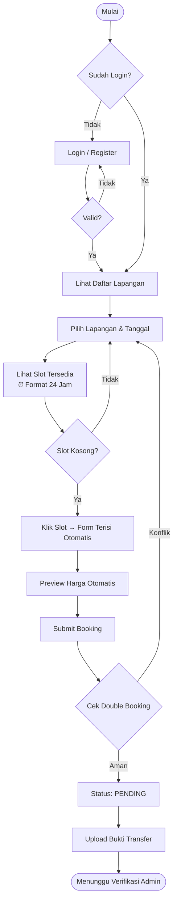
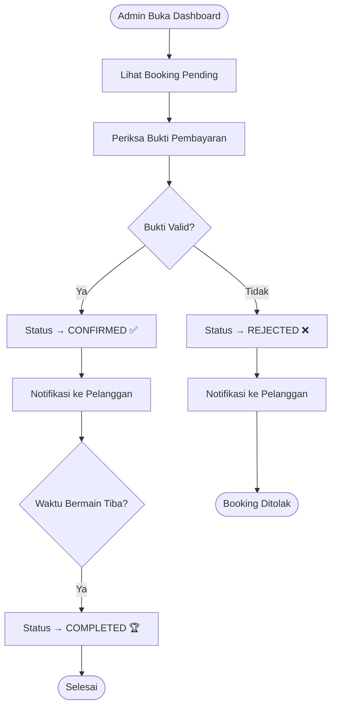
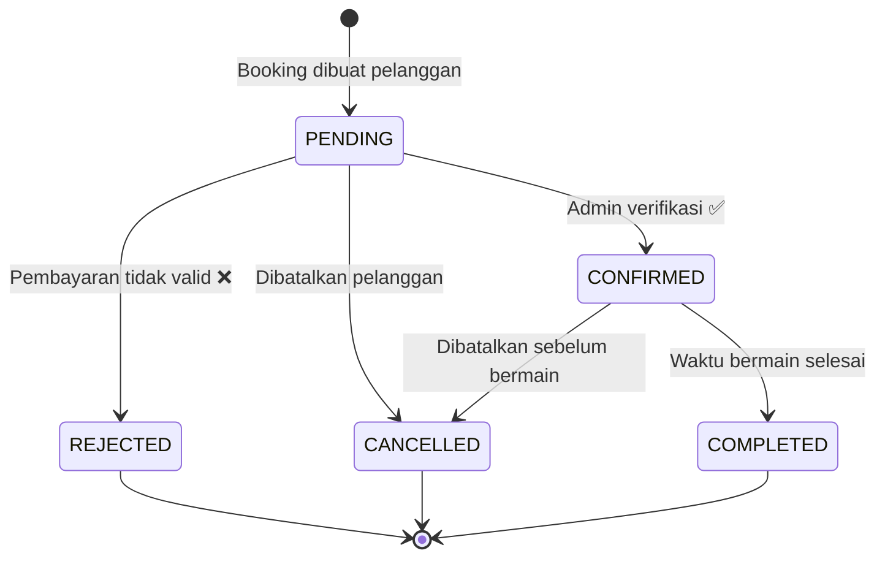

# PRESENTASI MINI SKRIPSI

---

## SLIDE 1 — COVER

# Rancang Bangun Sistem Informasi Reservasi Lapangan Olahraga Berbasis Web Menggunakan Framework Laravel

**Nama** : [Nama Mahasiswa]
**NIM** : [NIM]
**Program Studi** : Teknik Informatika / Sistem Informasi
**Pembimbing** : [Nama Dosen Pembimbing]
**Tahun** : 2025/2026

---

## SLIDE 2 — AGENDA

## Agenda Presentasi

1. 🔍 Latar Belakang
2. ❓ Rumusan & Tujuan Masalah
3. 📚 Landasan Teori
4. 🛠️ Metodologi & Perancangan
5. 💻 Implementasi & Hasil
6. 🧪 Pengujian
7. ✅ Kesimpulan & Saran

---

## SLIDE 3 — LATAR BELAKANG

## Latar Belakang

### Kondisi Saat Ini

> Mayoritas pengelola lapangan olahraga masih menerima pemesanan via **WhatsApp / telepon / buku catatan**

### Masalah yang Timbul

| Masalah | Dampak |
|---|---|
| 📅 Double booking | Dua pelanggan klaim slot yang sama |
| 🔒 Jadwal tidak transparan | Pelanggan harus tanya dulu ke admin |
| 💸 Rekap keuangan manual | Rentan salah catat & kehilangan data |
| 📄 Bukti bayar tidak terarsip | Potensi sengketa transaksi |

---

## SLIDE 4 — SOLUSI

## Solusi : SportBook 🏟️

### Sistem Informasi Reservasi Lapangan Olahraga Berbasis Web

```
Pelanggan bisa booking sendiri, kapan saja, tanpa perlu hubungi admin
Admin kelola semua dari satu dashboard
Laporan pendapatan otomatis, bisa export CSV & PDF
```

### Mendukung Jenis Olahraga
⚽ Futsal &nbsp;|&nbsp; 🏸 Badminton &nbsp;|&nbsp; 🏀 Basket &nbsp;|&nbsp; 🥅 Mini Soccer

---

## SLIDE 5 — RUMUSAN & TUJUAN MASALAH

## Rumusan Masalah

1. Bagaimana mencegah terjadinya *double booking* secara otomatis?
2. Bagaimana menampilkan slot ketersediaan secara *real-time* format 24 jam?
3. Bagaimana membangun alur verifikasi pembayaran manual yang terstruktur?
4. Bagaimana menghasilkan laporan yang dapat diekspor ke CSV dan PDF?

## Tujuan Penelitian

1. Membangun sistem reservasi berbasis web menggunakan **Laravel 12**
2. Mencegah *double booking* via validasi berlapis
3. Menyediakan slot real-time format **24 jam (00:00 – 23:00)**
4. Dashboard admin + **export laporan CSV & PDF**
5. REST API dengan **Laravel Sanctum** untuk skalabilitas mobile

---

## SLIDE 6 — TECH STACK

## Tech Stack yang Digunakan

### Backend
| Teknologi | Versi | Fungsi |
|---|---|---|
| PHP | 8.2+ | Bahasa pemrograman |
| **Laravel** | 12.x | Framework MVC utama |
| Laravel Sanctum | 4.x | Autentikasi REST API |
| Eloquent ORM | bawaan | Query database |

### Frontend
| Teknologi | Versi | Fungsi |
|---|---|---|
| **Bootstrap** | 5.3 | UI responsif |
| Blade Template | bawaan | Server-side rendering |
| Vanilla JS | ES6+ | Slot grid, AJAX, preview harga |

### Database
| Teknologi | Fungsi |
|---|---|
| **MySQL 8** | Database produksi |
| SQLite | Development & testing |

---

## SLIDE 7 — ARSITEKTUR SISTEM

## Arsitektur MVC

```
┌─────────────────────────────────┐
│         CLIENT BROWSER          │
│   Blade Views + Bootstrap 5     │
└────────────────┬────────────────┘
                 │ HTTP Request
┌────────────────▼────────────────┐
│         LARAVEL 12 (MVC)        │
│                                 │
│  Routes → Controllers → Views   │
│              ↓                  │
│      Models (Eloquent ORM)      │
│  User·Field·Booking·Payment     │
│              ↓                  │
│    Middleware (Admin/Customer)   │
│    Laravel Sanctum (API Auth)   │
└────────────────┬────────────────┘
                 │
┌────────────────▼────────────────┐
│     DATABASE MySQL / SQLite     │
└─────────────────────────────────┘
```

---

## SLIDE 8 — DESAIN DATABASE

## Skema Database (6 Tabel)

```mermaid
erDiagram
    users ||--o{ bookings : "membuat"
    users ||--o{ venues : "memiliki"
    venues ||--o{ fields : "memiliki"
    fields ||--o{ field_schedules : "punya jadwal"
    fields ||--o{ bookings : "dipesan via"
    bookings ||--o| payments : "dibayar dengan"

    users {
        id PK
        name string
        email string
        role enum
        password string
    }
    fields {
        id PK
        venue_id FK
        name string
        sport_type string
        price_per_hour decimal
        is_active boolean
    }
    bookings {
        id PK
        user_id FK
        field_id FK
        booking_date date
        start_time time
        end_time time
        status enum
        total_price decimal
    }
    payments {
        id PK
        booking_id FK
        payment_proof string
        status enum
        verified_by FK
    }
```

---

## SLIDE 9 — FLOWCHART BOOKING

## Alur Proses Booking Pelanggan



---

## SLIDE 10 — FLOWCHART VERIFIKASI

## Alur Verifikasi Pembayaran oleh Admin



---

## SLIDE 11 — STATUS BOOKING

## Diagram Status Booking



---

## SLIDE 12 — FITUR UTAMA

## Fitur Utama Sistem

### 👤 Modul Pelanggan
- ✅ Registrasi & Login
- ✅ Lihat daftar & detail lapangan
- ✅ Cek slot real-time **format 24 jam**
- ✅ Buat booking + preview harga otomatis
- ✅ Upload bukti pembayaran
- ✅ Riwayat & batalkan booking

### 🛡️ Modul Admin
- ✅ Dashboard statistik harian
- ✅ CRUD lapangan & jadwal operasional
- ✅ Verifikasi pembayaran & ubah status
- ✅ Laporan pendapatan per bulan
- ✅ **Export CSV** (kompatibel Excel)
- ✅ **Export PDF** (print browser)

---

## SLIDE 13 — FITUR UNGGULAN

## Fitur Unggulan

### 🔒 Anti Double Booking
Validasi berlapis — cek konflik slot sebelum booking disimpan ke database

```php
$conflict = Booking::where('field_id', $request->field_id)
    ->where('booking_date', $request->booking_date)
    ->where('status', '!=', 'cancelled')
    ->where(function ($q) use ($request) {
        $q->whereBetween('start_time', [$request->start_time, $request->end_time])
          ->orWhereBetween('end_time', [$request->start_time, $request->end_time]);
    })->exists();
```

### ⏰ Slot Format 24 Jam
Grid slot **00:00 – 23:00** — mudah dipahami pengguna awam Indonesia

### 📊 Export Laporan Tanpa Package Tambahan
CSV pakai `fputcsv` native PHP + BOM UTF-8 untuk Excel
PDF pakai print browser dengan `@media print` CSS

---

## SLIDE 14 — REST API

## REST API (Laravel Sanctum)

| Method | Endpoint | Auth |
|---|---|---|
| POST | `/api/register` | Public |
| POST | `/api/login` | Public |
| GET | `/api/fields/{id}/availability` | Public |
| POST | `/api/bookings` | Customer Token |
| GET | `/api/bookings/me` | Customer Token |
| PUT | `/api/bookings/{id}/cancel` | Customer Token |
| POST | `/api/payments/{id}/upload` | Customer Token |
| GET | `/api/admin/bookings` | Admin Token |
| PUT | `/api/admin/bookings/{id}/status` | Admin Token |
| GET | `/api/admin/reports` | Admin Token |

> API ini siap digunakan oleh aplikasi mobile (Flutter / React Native) di masa depan

---

## SLIDE 15 — PENGUJIAN

## Hasil Pengujian Black-Box

**Total: 22 skenario uji — Lulus semua ✅**

| Modul | Jumlah TC | Lulus | Gagal |
|---|---|---|---|
| Autentikasi | 5 | ✅ 5 | — |
| Booking | 5 | ✅ 5 | — |
| Pembayaran & Admin | 4 | ✅ 4 | — |
| Laporan & Export | 4 | ✅ 4 | — |
| REST API | 4 | ✅ 4 | — |
| **Total** | **22** | **22** | **0** |

### Responsivitas
| Perangkat | Hasil |
|---|---|
| Desktop 1920px | ✅ Normal |
| Tablet 768px | ✅ Responsif |
| Mobile 375px | ✅ Responsif |

---

## SLIDE 15B — DEPLOYMENT & HOSTING

## Deployment — Hostinger 🌐

### Platform Hosting

| Item | Detail |
|---|---|
| **Provider** | Hostinger |
| **Tipe** | Web Hosting / VPS |
| **Web Server** | LiteSpeed / Nginx |
| **PHP** | 8.2+ |
| **Database** | MySQL 8.0 |
| **SSL** | ✅ HTTPS (Let's Encrypt) |

### Langkah Deployment

```
1. Upload project via File Manager / FTP / Git
2. Konfigurasi .env (APP_URL, DB_HOST, DB_DATABASE)
3. Jalankan: php artisan migrate --force
4. Jalankan: php artisan storage:link
5. Set document root → folder /public
6. SSL aktifkan dari panel Hostinger
```

### Keunggulan Hosting di Hostinger

- ⚡ Uptime **99.9%** — sistem selalu dapat diakses
- 🔒 SSL gratis — data pelanggan terenkripsi HTTPS
- 🗄️ MySQL tersedia — tidak perlu konfigurasi tambahan
- 📁 File Manager & phpMyAdmin bawaan
- 🌍 Server Asia Tenggara — latensi rendah untuk pengguna Indonesia
- 💰 Harga terjangkau untuk skala UMKM lapangan olahraga

### Status Sistem

> ✅ **Sistem SportBook telah berhasil di-deploy dan dapat diakses secara online melalui Hostinger**

---

## SLIDE 16 — KESIMPULAN

## Kesimpulan

> Sistem **SportBook** berhasil dibangun dan memenuhi seluruh tujuan penelitian

1. ✅ Sistem reservasi lapangan olahraga berbasis web dengan **Laravel 12** berhasil diimplementasikan
2. ✅ **Double booking** berhasil dicegah melalui validasi berlapis di level aplikasi dan database
3. ✅ Slot ketersediaan real-time **format 24 jam** berhasil ditampilkan dan mudah dipahami pengguna awam
4. ✅ Laporan pendapatan dapat diekspor ke **CSV dan PDF** tanpa package tambahan
5. ✅ **22/22 skenario uji** black-box lulus — tingkat keberhasilan **100%**
6. ✅ REST API Sanctum siap sebagai fondasi pengembangan aplikasi mobile
7. ✅ Sistem telah **di-deploy di Hostinger** dan dapat diakses secara online dengan HTTPS

---

## SLIDE 17 — PENUTUP

## Terima Kasih 🙏

---

### Rancang Bangun Sistem Informasi Reservasi Lapangan Olahraga Berbasis Web Menggunakan Framework Laravel

**[Nama Mahasiswa] — [NIM]**
**[Program Studi] — [Tahun]**

---

> *"Teknologi bukan sekadar alat, melainkan solusi nyata untuk masalah sehari-hari."*

---

**Sesi Tanya Jawab**

---

## CATATAN PENGGUNAAN

> Presentasi ini menggunakan sintaks **Mermaid** untuk diagram.
>
> Untuk tampilkan diagram, buka file ini dengan:
> - **VS Code** + extension *Markdown Preview Mermaid Support*
> - **Obsidian** (render otomatis)
> - **GitHub / GitLab** (render otomatis saat push)
> - **Marp** — konversi ke PowerPoint/PDF: `marp PRESENTASI.md --pptx`
> - Online: https://mermaid.live (untuk diagram saja)
